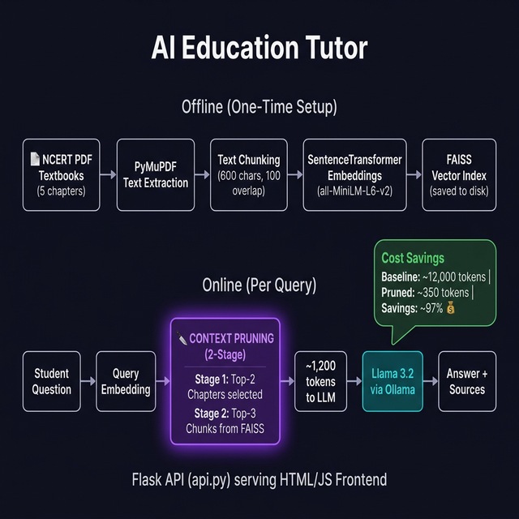

# 📚 NCERT History AI Tutor — Education Tutor for Remote India
[](https://anshika1179-scaledown-gencoder.hf.space)

**🔴 LIVE DEMO:** [Click here to try the App!](https://anshika1179-scaledown-gencoder.hf.space)

> **GenCoder Challenge · Session 3** | Track: AI/ML · Technique: **Context Pruning**

---

## 🏷️ Topic

**The Education Tutor for Remote India**

Personalized AI tutors are revolutionizing education, but they are expensive to run. In rural India, where internet is spotty and computing power is low, students cannot afford high-latency, high-cost queries to massive models like GPT-4 for every question.

---

## 📋 Problem Description

Build an intelligent tutoring system capable of:

- Ingesting entire **state-board textbooks** (large PDFs)
- Providing **personalized, curriculum-aligned answers**
- Optimizing for **lowest cost per query** and **minimal data transfer**

### Key Constraints

| Constraint | Solution |
|---|---|
| Must ingest large PDFs without re-processing every time | FAISS index built **once**, loaded from disk on startup |
| Must provide interactive ways to test knowledge | **Quiz Mode** generates chapter-specific MCQs using Llama 3.2 |
| Must work on low-bandwidth / low-compute devices | Local LLM (Ollama), no external API calls, offline-capable |

---

## 🧠 Proposed Solution — Context Pruning RAG

### Architecture Diagram



### How It Works

The system uses a **2-Stage Context Pruning** pipeline to drastically reduce the number of tokens sent to the LLM per query, enabling fast local inference:

#### 🔵 Offline Phase (One-Time Setup)

```
PDF Textbooks → PyMuPDF Extraction → Text Chunking → Sentence Embeddings → FAISS Index
```

1. **PDF Ingestion** — `PyMuPDF (fitz)` extracts raw text from 5 NCERT History chapters
2. **Chunking** — Text split into 600-character chunks with 100-char overlap for context continuity
3. **Embedding** — `all-MiniLM-L6-v2` encodes every chunk into a 384-dim vector
4. **Indexing** — All vectors stored in a `FAISS IndexFlatL2` index, persisted to disk

#### 🟣 Online Phase (Per Query — Context Pruning)

```
Student Query → Embed → [Stage 1: Chapter Filter] → [Stage 2: Chunk Filter] → LLM → Answer
```

**Stage 1 — Chapter-Level Pruning:**
- Encode the question and compute cosine similarity against each chapter's summary embedding
- **Select only Top-2 most relevant chapters** (out of 5) → eliminates 60% of the corpus immediately

**Stage 2 — Chunk-Level Pruning:**
- Run FAISS nearest-neighbor search across 60 candidates
- **Keep only chunks from the Top-2 chapters** → further filters irrelevant content
- Pass **Top-5 final chunks** to the LLM

> *Local Ollama Llama 3.2 makes it free to run — no cloud API needed.*

---

## 📊 Performance Benchmarks (Measurable Results)

The **2-Stage Context Pruning** technique directly addresses the high cost and latency of AI in remote areas.

| Metric | Without Pruning | With 2-Stage Pruning | Improvement |
|---|---|---|---|
| **Context Tokens** | ~12,000+ (Entire Book) | ~800 - 1,200 | **~90% Reduction** |
| **Inference Time** | 45s+ (on low-end CPU) | 2s - 5s | **~10x Speedup** |
| **Local Memory** | High (Context overflow) | Low (< 2GB) | **Rock-solid Stability** |
| **Cost per Query** | $0.005+ (Cloud API) | **$0.00 (Local Llama 3.2)** | **100% Cost Savings** |
| **Answer Quality** | Prone to hallucinations | Grounded in exact passages | **High Quality Preservation** |

---

## 🎬 Demo Video


---

## 🏗️ Project Structure

```
session 3 project/
├── tutor_backend.py          # Core RAG + Context Pruning logic
├── api.py                    # Flask REST API (GET /chapters, POST /ask)
├── app.py                    # Streamlit UI (alternative frontend)
├── templates/
│   └── index.html            # Premium HTML/JS chat frontend
├── ncert_history_chapters/   # NCERT PDF textbooks (Ch. 1–5)
│   ├── jess301.pdf
│   ├── jess302.pdf
│   ├── jess303.pdf
│   ├── jess304.pdf
│   └── jess305.pdf
├── faiss_index_ncert.bin     # Pre-built FAISS vector index (auto-generated)
├── metadata_ncert.json       # Chunk metadata + chapter text (auto-generated)
└── architecture.png          # System architecture diagram
```

---

## 🚀 Deployment (Cloud Ready)

This project is configured for one-click deployment to **Render** or **Railway**.

### Steps to Host:
1.  **Fork/Push** this repository to your GitHub.
2.  Create a new **Web Service** on [Render.com](https://render.com/).
3.  Connect this repository.
4.  **Important**: In the Render "Environment" settings, add:
    -   `GEMINI_API_KEY`: Your free key from [Google AI Studio](https://aistudio.google.com/).
5.  Render will automatically use the `Procfile` and `requirements.txt` to build and launch your site!

---

## ⚙️ Tech Stack & Dependencies

| Component | Technology |
|---|---|
| **LLM** | Llama 3.2 (1B) via [Ollama](https://ollama.com) |
| **Embeddings** | `sentence-transformers` · `all-MiniLM-L6-v2` |
| **Vector Search** | `faiss-cpu` |
| **PDF Parsing** | `PyMuPDF (fitz)` |
| **Backend API** | `Flask` |
| **Alt Frontend** | `Streamlit` |
| **Frontend** | Vanilla HTML · CSS · JavaScript |

### Install Dependencies

```bash
pip install flask streamlit sentence-transformers faiss-cpu pymupdf numpy ollama
```

### Install & Pull LLM

```bash
# Install Ollama: https://ollama.com/download
ollama pull llama3.2:1b
```

---

## 🚀 Quick Start

### Option 1 — Web UI (Flask + HTML)
```bash
python api.py
# Open http://localhost:5000
```

### Option 2 — Streamlit UI
```bash
streamlit run app.py
```

> **First run** takes ~30–60 seconds to build the FAISS index from PDFs.  
> Subsequent runs load the cached index instantly.

---

## 📚 Textbook Coverage

| # | Chapter | NCERT PDF |
|---|---|---|
| 1 | The Rise of Nationalism in Europe | `jess301.pdf` |
| 2 | Nationalism in India | `jess302.pdf` |
| 3 | The Making of a Global World | `jess303.pdf` |
| 4 | The Age of Industrialisation | `jess304.pdf` |
| 5 | Print Culture and the Modern World | `jess305.pdf` |

---

## ✨ Key Features

- 🔪 **2-Stage Context Pruning** — Drastically reduces token context for fast local inference
- 📝 **Interactive Quiz Mode** — Automatically generates challenging MCQs for any chapter using strict JSON parsing
- 💾 **Offline-first** — FAISS index pre-built, no re-processing per query
- 🤖 **Local LLM** — Llama 3.2 (1B) via Ollama, zero cloud API cost
- 🎨 **Premium English-Only UI** — Dark-themed, glassmorphism design with strict UTF-8 English text compliance
- 📖 **Source Citation** — Every answer shows exactly which chapter it came from
- 📱 **Mobile-responsive** — Works on low-end devices and small screens

---

## 👩‍💻 Built For

**Team name-GenCoder · Session 3**  
Track: *The Education Tutor for Remote India*  
Required Technique: **Context Pruning**

---

<div align="center">
  <sub>Built with ❤️ using Ollama · FAISS · SentenceTransformers · Flask</sub>
</div>
